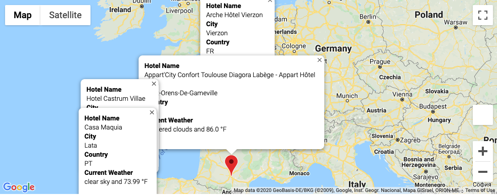

# World_Weather_Analysis

## Resources
    - APIs: OpenWeatherMap, Google Maps Platform
    - Data Source: WeatherPy_databse.csv, WeatherPy_Vacation.csv
    - Software: Python 3.7.6, conda 4.8.3, Visual Studio Code 1.46.0, Jupyter Notebook 6.0.3

## Challenge Objectives and Results
The objective of this analysis was to successfully utilize APIs and try-exept blocks in order to determine a potential list of cities for customers to visit on vacation. OpenWeatherMap was used to obtain a random list of cities while Google Maps Platform was used to obtain hotel names and map images. The data frame was filtered to cities within 70-90F temperature with no rain or snow fall. From this list of cities, the following four were determined optimal for a European road trip. 

Cities:
    - Vierzon, France
    - Saint-Orens-De-Gameville, France
    - Vila, Portugal
    - Lata, Portugal

### Results
Maps of the cities hotels and driving directions are shown as the results of this challenge.

